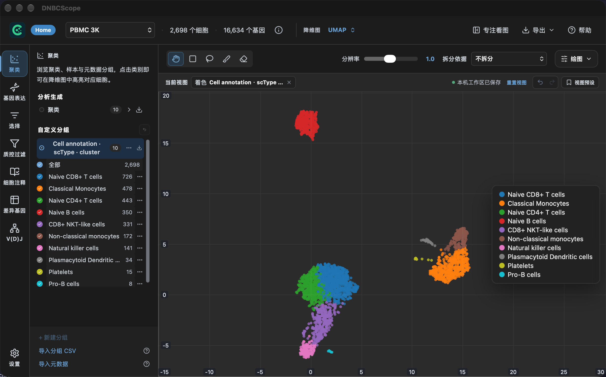

  
  <h1>DNBCScope Desktop</h1>
  
<strong>本地运行的单细胞数据分析桌面软件</strong> 
  Explore, analyze, and export single-cell data in one focused workspace.

  

    
    
    
    
  

DNBCScope is a cross-platform desktop application for exploring and analyzing
single-cell expression data. It brings quality control, dimensional reduction,
clustering, annotation, differential expression, V(D)J exploration, and figure
export into one local workspace. The application is designed for large projects:
interactive plots use WebGL and analysis data stays on the computer running the app.

> **Beta preview** — feedback, reproducible examples, and bug reports are welcome.

## What the desktop app does

- **Analysis pipeline:** normalization, HVG, PCA, neighbors, **Leiden** clustering, UMAP/t-SNE, and optional **Harmony** integration for multi-sample projects.
- **Annotation:** cell-type labeling with **scType** or **CellTypist** models, compared alongside clusters and sample metadata.
- **Interactive exploration:** zoomable **WebGL** embeddings, gene-expression coloring, manual/reusable selection, and differential expression with multi-sample pseudobulk.
- **V(D)J & export:** inspect receptor metadata when present, and export tables plus publication-ready PNG/SVG figures.

## Screenshots

The images below are screenshots from the DNBCScope desktop application using
the bundled example workflow. They are included to show the actual product UI,
not generic plotting examples.

  

## Download

Prebuilt installers are available from the [Releases](https://github.com/DNBelabCSeries/DNBCScope/releases) page — no compiler or Python setup is required for normal desktop use.

| Platform | Package | Notes |
| --- | --- | --- |
| macOS Apple silicon | [DNBCScope 0.1.0](https://github.com/DNBelabCSeries/DNBCScope/releases/download/0.1.0/DNBCScope_0.1.0_aarch64.dmg) | macOS 11 or newer |
| Windows x64 | [DNBCScope 0.1.0](https://github.com/DNBelabCSeries/DNBCScope/releases/download/0.1.0/DNBCScope_0.1.0_x64-setup.exe) | Current-user installation |

The release page is the source of truth for the latest installers and release
notes. If a direct link above changes, open the release page and choose the
matching package for your computer.

### First launch on an unsigned beta build

The beta installers are not code-signed yet. This can trigger an operating-system
publisher warning even though it does not indicate a data-analysis error.

- **macOS:** open **System Settings → Privacy & Security**, then choose **Open Anyway**.
  （macOS：打开**系统设置 → 隐私与安全性**，然后点**仍要打开**。）
- **Windows:** choose **More info → Run anyway** in SmartScreen.
  （Windows：在 SmartScreen 中点击**更多信息 → 仍要运行**。）

## Data and privacy

Core analysis runs locally. Project files, caches, and exports remain on the
locations selected on your computer; the app does not require an account or send
project data to a remote service. Downloading an optional annotation model is the
only workflow that may need network access.

## This branch

The `opensource` branch publishes the selected Python analysis and conversion
tools used by DNBCScope. The complete desktop shell, bundled runtime, models, and
release packaging are distributed through the installers in **Releases** rather
than as a full source checkout in this branch.

The tools are useful for inspection, reproducibility, and integration work. Their
command-line usage is documented at the top of each file in [`tools/`](tools/).

## Feedback and support

- Report a reproducible issue through [GitHub Issues](https://github.com/DNBelabCSeries/DNBCScope/issues).
- Include the operating system, app version, input format, and the exported
  diagnostic log when reporting a failure. Do not upload raw expression data or
  personally identifiable metadata.
- For workflow details, use the in-app **Help** manual after installing the app.

## License

DNBCScope's published tools are available under the [MIT License](LICENSE).
